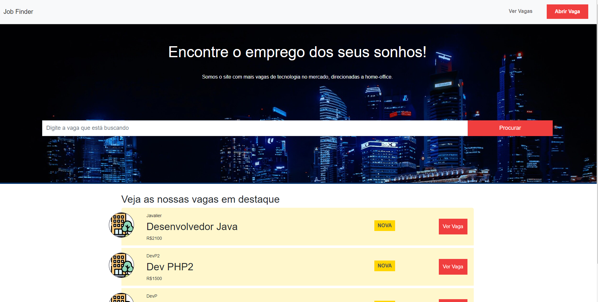
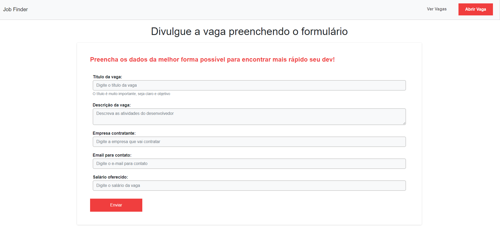
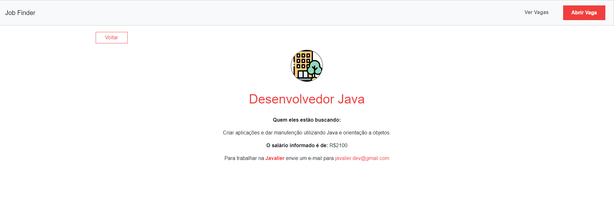
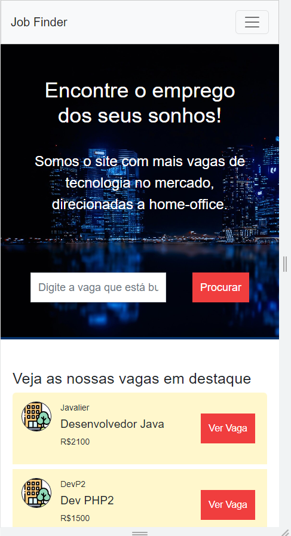
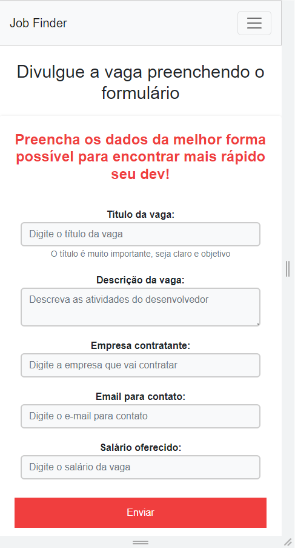
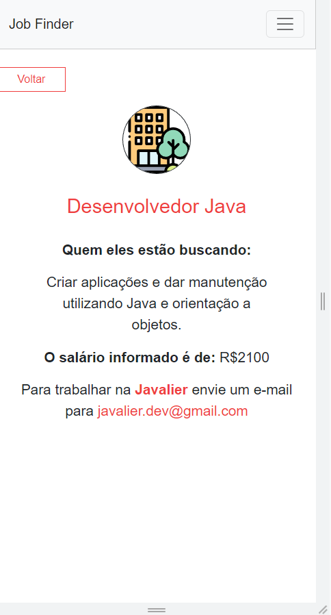

# Job Finder

Uma aplicação para cadastro e visualização de vagas para desenvolvedores.

Se você busca sua vaga na área de programação e deseja uma busca rápida com as principais informações e um cadastro simples para que te encontrem, esse portal é a sua cara.

## :mag_right:Sobre o projeto
Projeto realizado com os conhecimentos adquiridos no curso de Javascript do Básico ao Avançado, ministrado pelo Matheus Battisti, onde foi possível aprender e aplicar os conhecimento da linguagem Javascript e demais ferramentas na confecção deste projeto. Foi utilizado o HTML, CSS e o framework Bootstrap para realizar a estruturação e estilização das páginas no frontend, as rotas foram criadas utilizando o express, a estruturação das views e layouts foram aplicadas com o Handlebars permitindo ganho de tempo de desenvolvimento. No backend foi utilizado o Javascript para criação de lógicas junto ao Node.js, além disso foi o Sequelize um ORM (Object-Relational Mapping) Node.js que permitiu a troca de informação com o banco de dados SQLite de forma eficiênte e rápida.

## :gear: Tecnologias/Ferramentas usadas
- [HTML5](https://developer.mozilla.org/pt-BR/docs/Web/HTML)
- [CSS and Bootstrap](https://getbootstrap.com/)
- [Javascript](https://developer.mozilla.org/pt-BR/docs/Web/JavaScript)
- [Node.js](https://nodejs.org/en/)
- [Express and Express Handlebars](https://www.npmjs.com/package/express-handlebars)
- [Sequelize ORM](https://sequelize.org/)
- [SQLite](https://www.sqlite.org/index.html)

## :art: Layout
### Homepage

### Adicionar vaga

### Visualizar vaga

### Páginas responsivas

## :file_folder: Como executar o projeto

Requisitos: 
- node instalado na máquina
- git instalado na máquina
 
### Criar uma pasta para o projeto
No terminal, no local onde deseja criar uma pasta execute o comando: 
mkdir <nome_da_pasta>
### Clonar repositório
git clone https://github.com/DioneDw/jobfinder.git
### Instalar o node modules e dependências na pasta principal
npm install                                                                                                          
### Iniciar o servidor node (dentro da pasta principal. Executar):                                                                                  
npm run dev 
                                                                                                                                                          
## :raising_hand_man: Autor
Dione Willy Evangelista
https://www.linkedin.com/in/dione-willy-evangelista-59ab8314a/

---
---
